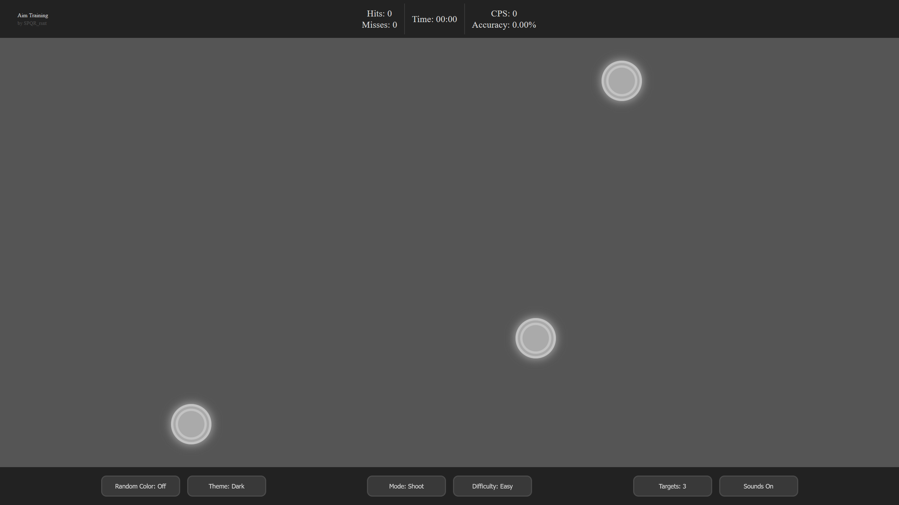

# Aim Training

A browser-based aim training application built with vanilla JavaScript using MVVM architecture.

## Features

- ✅ Theme system
- ✅ Statistics tracking
- ✅ Track & Shoot modes
- ✅ Sound effects
- ✅ Adaptive layout for desktop & mobile
- ✅ Configurable target count

## Tech Stack

- HTML
- CSS
- JavaScript (MVVM)

## How to Run

### 🌐 Online

Open the live version:  
👉 https://spqr2235.github.io/aim-training/

---

### 💻 Local

1. Clone the repository
   ```bash
   git clone https://github.com/SPQR2235/aim-training.git

2. Run with local server
